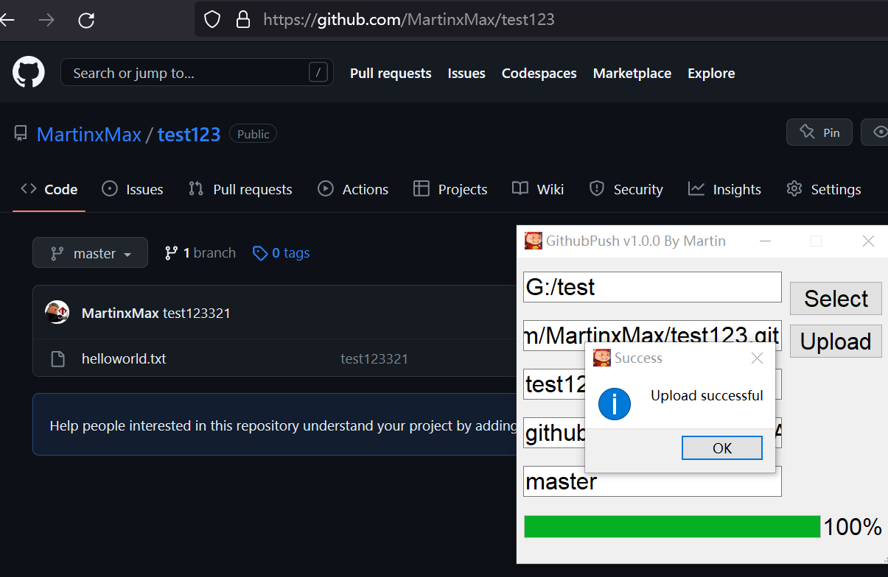

<div align="center">
<p align="center">
 
 
 
 </p>
   
 <table>
      <tr>
          <th>Function</th>
      </tr>
      <tr>
        <th>Github Push</th>
      </tr>
    </table>
</div>

## usage method

  * View help information

      ```#python3 GitPush.py ```
      
  
 
